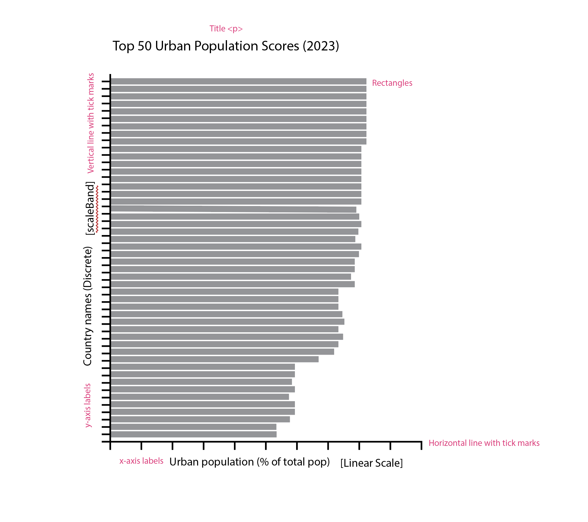
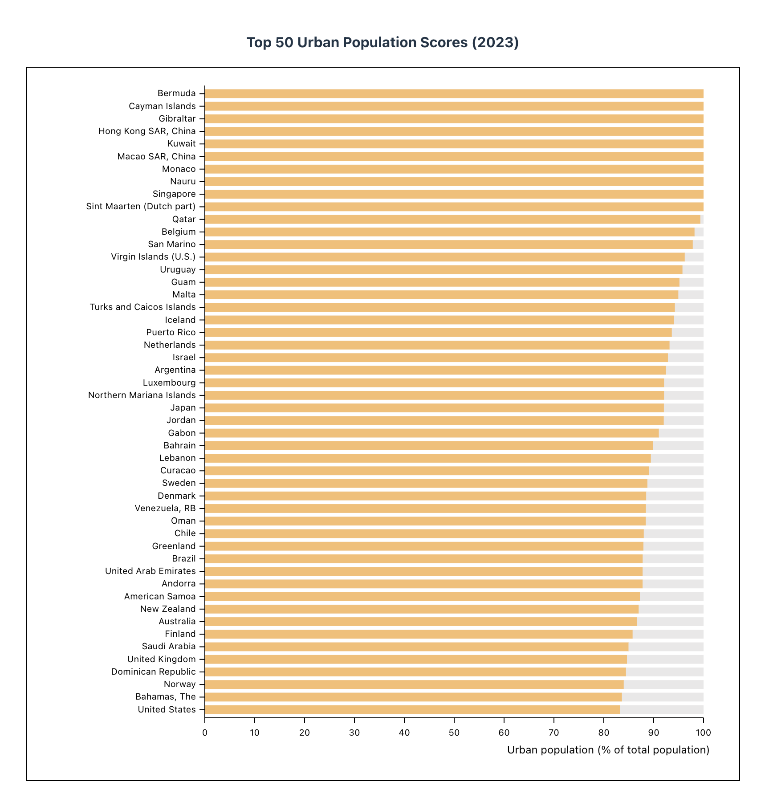

# Coding-Exercise-1
Coding Exercise 1

I chose to visualize the urban_population data set which contains measures for Urban population (% of total population) for 266 countries, ranging from 1960 to 2023. 

I pulled the top 50 countries with the highest % urban populations for the year 2023. Interestingly, several countries showed as having 100%. When investigating, there are some countries that have 100% measured for every year that the data has been recorded. I have been questioning if this is due to an error in the data or is that country really 100% urban?

The y-axis depicts the names of countries ranked in the top 50 global urban populations. This is Categorical (Nominal) Data and, as such, scaleBand() was used to map the data. 

The x-axis represents the percentage of urban population out of the total population of that country. This data is mapped using scaleLinear() as the data is continuous numerical data.

I highlighted the background of the chart grey as to better compare the distance (difference) in each county's measure from the max (100%).

